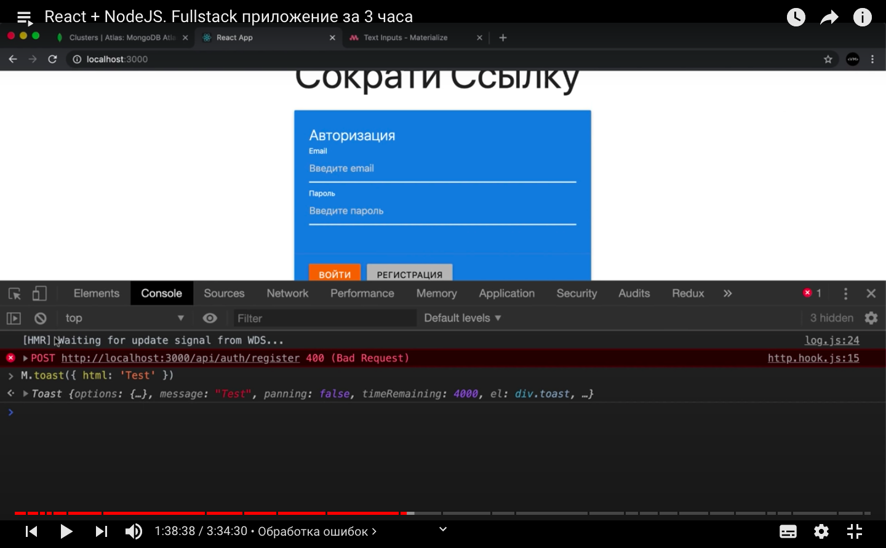

# url-shortener

План: сначала разработать базовый бэкэнд (разработать некоторые эндпоинты на node.js), потом соединить это все с фронт эндом.

## подключение сервера и базы данных mongoDB
1) начинаем с инициализации проекта
```
$ npm init
```
в корне проекта должен лежать бэкэнд

2) установим базовые зависимости
```
$ npm install express mongoose
```
пакет mongoose отвечает за соединение с базой и за работу с MongoDB

```
$ npm install -D nodemon concurrently
```
-D чтоб попало в dev dependencies

3) добавим скрипты в package.json (скрипт test мы удалили)
```
  "scripts": {
    "start": "node app.js",
    "server": "nodemon app.js"
  },
```
nodemon - пакет позволяющий перезапускать сервер чтоб не делать это вручную

Протестируем скрипты (в app.js напишем `console.log('App')`):
```
$ npm run server
```

4) как создаем базовые приложения на express - для начала мы его подключаем. В node.js
чтоб подключать пакеты есть глобальная функция require

хардкодить константы (номер порта 5000) плохо, нужно выносить в общий конфиг (`app.listen(5000, () => console.log(`App has been started...`))`); установим пакет `config` ($npm i config)
https://www.npmjs.com/package/config
```
$ npm install config
$ mkdir config
$ vi config/default.json
```
в config/default.json будем хранить константы для нашего проекта

 настройка сервера завершена:
```
// как создаем базовые приложения на express - для начала мы его подключаем. В node.js
// чтоб подключать пакеты есть глобальная функция require
const express = require('express')
const config = require('config')

// переменная, кот явл результатом работы ф-и express
// это наш будущий сервер
const app = express()

// с большой буквы ибо константа, если вдруг он не определен по умолч 5000
const PORT = config.get('port') || 5000

app.listen(PORT, () => console.log(`App has been started on port ${PORT}...`))
```

подключимся к mongoDB:
подключ пакет:
```
const mongoose = require('mongoose')
```
вызвать метод `connect`, кот позволит подключ к БД:
т.к. метод `connect` возвращает Promise, то чтоб воспольз удобным синтаксисом async await обернем все в ф-ю:
обертка чтоб польз синтаксисом async await:
```
async function start() {
    try {

    } catch (e) {

    }
}

start()
```

mongoDB site:
1) new Project
.
.
.

```
$ npm run server
```
connection method: Connect Your Application

копируем строчку `mongodb+srv://kseniia:<password>@cluster0.anb76.mongodb.net/app?retryWrites=true&w=majority` и встав ее в config ("mongoUri")
вместо myFirstDatabase ---> app; вмесо <password> вписать свой пароль
теперь:
```
[nodemon] starting `node app.js`
App has been started on port 5000...
```
## теперь нам надо зарегистрировать определенные роуты, кот будут по разному обрабат api запросы с нашего фронд энда
напр для авторизации:
```
app.use('/api/auth')
```

`mkdir routes`
```
// nак создать роут в экспрессе 
const {Router} = require('express')
const router = Router()

module.exports = router
```
and (app.js)
```
app.use('/api/auth', require('./routes/auth.routes'))
```

теперь в роутс необходимо создать 2 пост запроса - мы подшлтовили 2 эндпоинта, по кот мы в дальнейшем будем работать:
```
router.post('/register', async (req, res) => {

})

router.post('/login', async (req, res) => {

})
```
пока что у нас нет сущностей, работающих с пользователем, поэтому необходимо создать модель
`mkdir models` and `touch User.js` in /models

делаем авторизацию - ибо у каждого пользователя свой массив ссылок

`npm bcryptjs` - библиотека для шифрования
```
const hashedPassword = await bcrypt.hash(password, 12)
```

валидация полей пароля и имя пользователя на експрессе: `npm i express-validator`

// если дошли до этого этапа знач с польз все хорошо и нужно сделать его авторизацию
// т.к у нас single page app, авторизацию будем делать через jwt token
```
$ npm i jsonwebtoken
```
## подключаем фронт-энд (REACT)

все помещаем в папку client
```
$ npx create-react-app client
```
хотим использовать npm, а не yarn: `cd client/` ---> `rm -rf node_modules/` && `rm yarn.lock` && `rm -rf .git`

удалим ненужное: App.css, App.test.js

 установим библиотеки обратно: `npm i` in client folder
 // чтоб в папке client --prefix client

 в одном терминале запускать сервер, в другом клаянт неудобно, напишем еще один скрипт (use `concurrently`):
 ```
  "dev": "concurrently \"npm run server\" \"npm run client\""
```

чтоб не писать стили и упростить себе задачу: `materializecss.com`
in client/ folder: `npm install materialize-css@next` and `npm i react-router-dom` (для работы с роутами)

## Роуты
теперь нам нужно создать набор страниц кот будут работать в нашем приложении:
`cd client/ --> cd src/ ---> mkdir pages`
в pages созд все необх страницы, кот пр своей сути явл реакт компонентами (тут будем писать на функциональных компонентах и хуках)

## прокси 
```
  const registerHandler = async () => {
      try {
          const data = await request('api/auth/register', 'POST', {...form})
          console.log('Data', data)
      } catch (e) {}
  }
```

проблема с номером порта (у нас 5000б там 3000)

МЫ БУДЕМ ПРОКСИРОВАТЬ ЗАПРОСЫ С КЛИЕНТА НА СЕРВЕР
client/package.json ---> добавим
```
"proxy": "http://localhost:5000"
```

теперь у нас ошибка 400:

Связу́ющее програ́ммное обеспе́чение (англ. middleware; также переводится как промежу́точное программное обеспечение, программное обеспечение среднего слоя, подпрогра́ммное обеспечение, межплатфо́рменное программное обеспечение) — широко используемый термин, означающий слой или комплекс технологического программного обеспечения для обеспечения взаимодействия между различными приложениями, системами, компонентами.

## обработка ошибок

с помощью materialize toast буду показывать ошибки

сделаю это с помощью еще одного хука на клменте - `message.hook.js`


status 200 on login when email and user match

## работа над авторизаией
создаем хук `auth.hook.js`

как раб с авторизаз если взпимод с jwt token - если мы его получаем,то нам необх его хранить в LOCAL STARAGE, если перзагруз с-му и в локал сторадже есть валидный токен, то мы его используем и человека кидаем в саму с-му

// {token, login, logout, userId} эти знач хочу перед через контекст всему нашему приложению
cd src/ ---> mkdir context ---> touch AuthContext.js