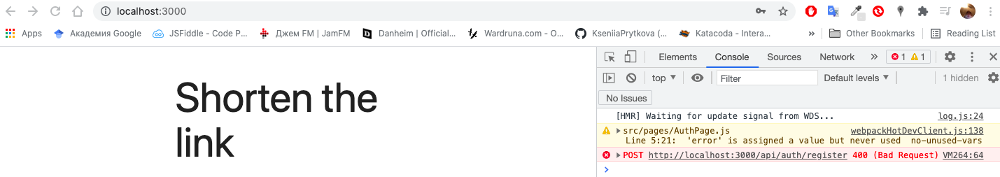

# url-shortener
Run:
```
$ npm i
$ npm run dev
```

# Development
First develop a basic backend (develop some endpoints in `Node.js`), then connect it all to the front end.

## Connect server; connect database mongoDB
1) Initialize the project:
```
$ npm init
```
the backend must be at the root of the project

2) Install basic dependencies:
```
$ npm install express mongoose
```
the `mongoose` package is responsible for connecting to the database and for working with `MongoDB`

```
$ npm install -D nodemon concurrently
```
`-D` flag to get into dev dependency

3) Add scripts to `package.json` (we removed the test script):
```
  "scripts": {
    "start": "node app.js",
    "server": "nodemon app.js"
  },
```
`nodemon` - a package that allows you to restart the server so as not to do it manually

Testing scripts (in `app.js` write `console.log('App')`):
```
$ npm run server
```

4) When we create basic applications in `express`, we first connect it. In `Node.js`
to include packages there is a global function `require`

Hardcoding constants (port number 5000) is bad, we need to put them in the general config (`app.listen (5000, () => console.log (` App has been started ... `))`); install the `config` package: (`$ npm i config`).

[config package](https://www.npmjs.com/package/config)
```
$ npm install config
$ mkdir config
$ vi config/default.json
```
in `config/default.json` we will store constants for our project

Server configuration completed:
``` js
const express = require('express')
const config = require('config')

// variable, which is the result of fn express()
// this is our future server
const app = express()

// capital letters for a constant, if suddenly it is not defined then default val is 5000
const PORT = config.get('port') || 5000

app.listen(PORT, () => console.log(`App has been started on port ${PORT}...`))
```

Connect to `mongoDB`:
connect package:
```
const mongoose = require('mongoose')
```
вызвать метод `connect`, кот позволит подключ к БД:
т.к. метод `connect` возвращает Promise, то чтоб воспольз удобным синтаксисом async await обернем все в ф-ю:
обертка чтоб польз синтаксисом async await:

call the `connect` method, which will allow the connection to the database: since the `connect` method returns a `Promise`, so to use the convenient `async await` syntax, we wrap everything in fn - a wrapper to use the async await syntax:
```
async function start() {
    try {

    } catch (e) {

    }
}

start()
```

[mongoDB site](https://cloud.mongodb.com/v2/60f29390b731e4772da5a418#metrics/replicaSet/60f294c178856a3e8986fb15/explorer/app/links/find):
1) new Project
.
.
.

```
$ npm run server
```
connection method: Connect Your Application

copy the line `mongodb+srv://kseniia:<password>@cluster0.anb76.mongodb.net/app?retryWrites=true&w=majority` and paste it in `config` (`"mongoUri"`)
instead of myFirstDatabase ---> app; instead of <password> write your password

next:
```
[nodemon] starting `node app.js`
App has been started on port 5000...
```

## Now we need to register certain routes that will process api requests from our frontend in different ways
for example for authorization:
```
app.use('/api/auth')
```

`mkdir routes`
```
// how to create a route in express
const {Router} = require('express')
const router = Router()

module.exports = router
```
and (app.js)
```
app.use('/api/auth', require('./routes/auth.routes'))
```

Now in the routes it is necessary to create 2 post requests - we have prepared 2 endpoints, on which we will work in the future:
```
router.post('/register', async (req, res) => {

})

router.post('/login', async (req, res) => {

})
```
So far we do not have entities working with the user, so we need to create a model
`mkdir models` and `touch User.js` in /models

We need to implement authorization - because each user has his own array of links

`npm bcryptjs` - encryption library
```
const hashedPassword = await bcrypt.hash(password, 12)
```

validation of password and username fields on express: `npm i express-validator`

If we have reached this stage, everything is fine with users and we need to authorize them. Because we have a `single page app`, we will do authorization via `jwt token`.
```
$ npm i jsonwebtoken
```

## Connect the front-end (REACT)

`client` folder:
```
$ npx create-react-app client
```
we want to use `npm`, not `yarn`: `cd client/` ---> `rm -rf node_modules/` && `rm yarn.lock` && `rm -rf .git`;

remove unnecessary: App.css, App.test.js;

install the libraries back: `npm i` in client folder (so that in the client folder `--prefix client`);

start the server in one terminal and the client in the other terminal is inconvenient, so write another script (use `concurrently`):
 ```
  "dev": "concurrently \"npm run server\" \"npm run client\""
```

so as not to write styles and to simplify the task: [materializecss.com](materializecss.com):
in client/ folder: `npm install materialize-css@next` and `npm i react-router-dom` (for working with routes)

## Routes
now we need to create a set of pages that will work in our application:
`cd client/ --> cd src/ ---> mkdir pages`
in `pages` create all the necessary pages, which in their essence are `react components` (here we will write on functional components and hooks)

## Proxy
```
  const registerHandler = async () => {
      try {
          const data = await request('api/auth/register', 'POST', {...form})
          console.log('Data', data)
      } catch (e) {}
  }
```

the problem with the port number (we have 5000 there 3000)

WE WILL PROXY REQUESTS FROM THE CLIENT TO THE SERVER
`client/package.json` ---> add
```
"proxy": "http://localhost:5000"
```

now we have error 400:


Bridging software (English middleware; also translated as middleware, middleware, subprogram, middleware) is a widely used term meaning a layer or complex of technological software to ensure interaction between various applications, systems, components.

## Error processing
show errors with the help of `materialize toast`

Do that with the help of another hook on the client - `message.hook.js`


status 200 on login when email and user match

## Authorization
Create a hook `auth.hook.js`

How to work with authorization if we interact with a `jwt token` - if we receive it, then we need to store it in `LOCAL STARAGE`, if the system is rebooted and there is a valid token in the local store, then we use it and throw the user into the system.

`{token, login, logout, userId}` pass these values through the context to entire application;
cd `src/` ---> `mkdir context` ---> `touch AuthContext.js`

## Logic on the server (link shortening)
routes/ ---> touch `link.routes.js` - these routes will be responsible for generating links, which we will shorten in the application;
models/ ---> touch `Link.js`


## Add <Loader /> component
By default we load routes where there is no authorization.

In `auth.hook.js` we can add new flag `const [ready, setReady] = useState(false)`
`
add `Loader.js` component ([preloader from materialize](https://materializecss.com/preloader.html));
now `Loader` works by default - and when the authorization module works, then we load our entire application.

## DetailPage
We also need `get` parameters (http://localhost:3000/detail/60f44265cb62848085e99fe5) - extract `id` (60f44265cb62848085e99fe5) and load the data. Use method `useParams` from `react-router-dom`.


